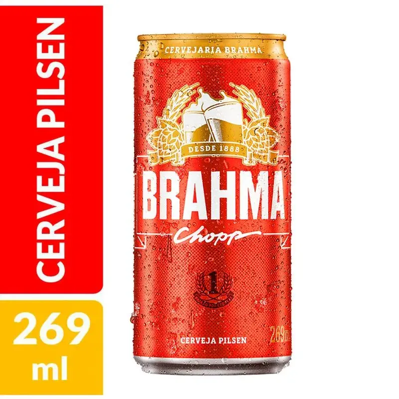
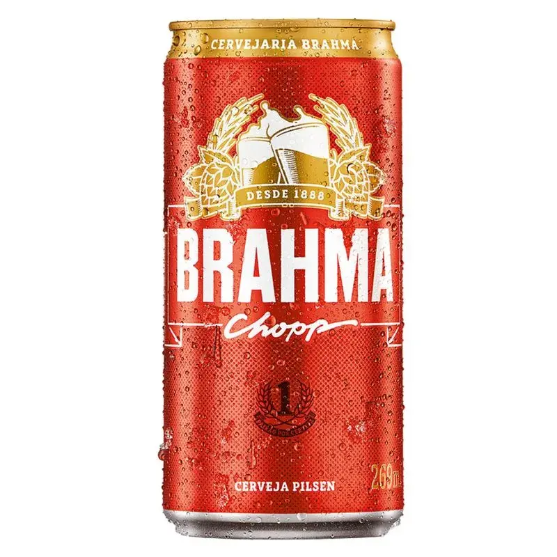

# Microserviço: tratamento-imagens

explicação em texto humano do desenvolvedor, esse texto vai possui erros de ortografias e um fluxo caracteristo do programador 

As imagens dos produtos em um ecomerce sao a vitrine da loja , vamos aplicar um fluxo pra tratar isso de uma forma otimizada e visualmente agradável

As imagens dos produtos serao capturas por um outro processo , que não é relevante para esse processo, mas teremos sempre um url dessa imagem, seja no nosso provedor ou externo.
Use esse json como amostra para enteder isso [text](../../WWW/MICROSERVICE/MOCK-END/PROJETOS/connect/handlers/mock/api/all_products.json)
vai ser necessario mapear quais informações são relevante e quais não sao.
Vou começar pela mais basica o url das imagens, as chaves são: 
"imagem": "https://www.catalogoambev.com.br/images/uploads/artes-finais/055bd92bcad8a1b34b5189dbea6bbd04.png", (imagem principal)
"imagens": [], (lista de imagens secundárias, opcional)

nessa pasta estão algumas imagens de amostra [text](../ASSETS/amostra)
essa amostra é para deixar claro que o formato , dimenssões e arquivo dessas imagens são variados e nao tem nenhum padrão

Estamos mirando em criar um padrão solido para as imagens, vamos ver varios pontos desse padrão:

todos pontos abaixo vamos converter em parametros, um json de config  pode ser uma boa alternativa


extenssão: webp
compressão: prescisamos de um equilibrio entre tamanho e qualidade, sendo a qualidade nossa prioridade

tamanho: vamos minimizar o resize nas imagens pelo html. Prescisamos criar um ficha de tamanhos. Essa ficha eu nao tenho completa , pode acontecer a necessidade de add , editar ou remover essa configuração. Mas vamos usar um set basico de:
thumbnail, small, medium, large, full
esse set prescisamos refatorar pois ele deve ser compativel para desktop e mobile. (o set de tamanho com certeza vai aumentar, mas inicialmente vamos prever q o set é dinamico , porem vamos usar esse default)
IMPORTANTE, nossa ficha de tamanho pode ser variavel, mas a proporção tem que ser uniforme (vamos usar imagens quadradas, ou em retrato ou em paisagem, mas nunca vamos ter uma imagem em varios os modos)

template ficha_tamanho (proposta):
```json
{
  "ficha_tamanho": {
    "version": 1,
    "ativo": true,
    "proporcao": {
      "modo": "quadrado",
      "ratio": "1:1"
    },
    "regra_resize": {
      "fit": "contain",
      "sem_upscale": true,
      "origem_master": "full"
    },
    "acabamento": {
      "usar_apenas_sangria": true,
      "sangria": {
        "modo": "percentual",
        "padrao_pct": 0.08,
        "com_badge_pct": 0.06
      },
      "borda": {
        "ativa": false
      }
    },
    "breakpoints": {
      "mobile_max": 767,
      "desktop_min": 768
    },
    "tamanhos": [
      {
        "chave": "thumbnail",
        "largura": 120,
        "altura": 120,
        "badge_permitido": false,
        "densidades": [1, 2]
      },
      {
        "chave": "small",
        "largura": 240,
        "altura": 240,
        "badge_permitido": false,
        "densidades": [1, 2]
      },
      {
        "chave": "medium",
        "largura": 400,
        "altura": 400,
        "badge_permitido": true,
        "densidades": [1, 2]
      },
      {
        "chave": "large",
        "largura": 700,
        "altura": 700,
        "badge_permitido": true,
        "densidades": [1, 2]
      },
      {
        "chave": "full",
        "largura": 1000,
        "altura": 1000,
        "badge_permitido": true,
        "densidades": [1, 2]
      }
    ],
    "mapa_uso": {
      "mobile": {
        "grid": "small",
        "pdp_galeria": "medium",
        "zoom": "full"
      },
      "desktop": {
        "grid": "medium",
        "pdp_galeria": "large",
        "zoom": "full"
      }
    },
    "fallback": {
      "se_full_nao_for_viavel": ["large", "medium"],
      "minimo_aceitavel": "medium"
    }
  }
}
```

background:vamos usar um parametro , com um valor de cor rgb ou transparente

nome do arquivo, prescisamos saber se usar um nome em hash ou um nome mais seo frindly (qual vantagem cada caso tem e a complexidade para gerar esse nome)

badge: Opcional
caso sim , prescisamos de um mockup em html como o exemplo nessa imagem . Os quadros em vermelho e amarelo a esquerda é badge , presciso de ajuda pra criar a parametrização do bage (cor do bg, cor da fonte, os textos , e os outros detalhes que nao sitei mas que são relevantes e me permita gerar um html paravalidar esse badge)
presciso dele em 2 verssões horizontal e vertical , vai depender da proporção da imagem TRIM (abaixo esta a descriçaõ ssobre)

FLUXO:
1 passo, 
no json acima , temos o url da imagem principal e uma lista de imagens secundárias. Vamos agrupar as imagens principal e secundárias em um array , onde a chave 0 é sempre a principal. Vamos aplicar o fluxo completo uma imagem por vez desse array, e produto por produto completando todas imagens do json. 

1.1 passo,
Para manipular elas vamos salvar localmente. Vamos chamar de imagem_original. Ele deve ser exatamente a imagem original sem edição ou qualquer alteração.
Vamos ter que organizar um diretorio onde vamos salvar essas imagens. (vamos ter diversos diretorios ao longo do fluxo). 

2 passo 
remover o background , as imagem_original, possuem geralmente um background , ou uma borda, ou uma sangria, um padding , elas raramente sao apenas o produto com (trim)
Exatamentte o q queremos fazer um trim, remover todo extra , queremos apenas o produto

2.1 
vou chamar de trim essa imagem sem bordas. é nossa primeira validaçaõ. Como temos diversos tamanhos, temos encontrar um tamanho minimo para que o resize da nossa ficha de tamanhos não gere imagens de resolução baixa. Vamos ter como critico a qualidade da imagem medium. Caso o nosso trim seja insuficiente para um tamanho medium de boa resolução. A gente interrompe o processo Como imagem de baixa qualidade. Se o trim for de um tamanho superior, otimo os tamanhos large e full tbem teram uma boa qualidade
Vamos criar uma pasta para TRIM para salvar essa imagem

3 passo
Vamos criar a imagem da ficha de tamanho FULL. O tamanho full vai depender do trim . O full vai ter um tamanho maximo de 1000px (depende da proporção, pode ser a largura ou a altura ou ambos). Porem prescisamos saber o trim é suficiente para gerar uma imagem de 1000px, sim , geramos | não tentamos com o proximo tamanho (large). 
validamos novamente se é suficiente para o large , caso não usamos o medium
Não vai ter um caso de não para medium, pois se acontecer o passo 2.1 ja interrompeo o fluxo
O tamanho da imagem_full , é o canvas dessa imagem. e o trim tem que ser centralizado e redimencionado proporcionalmente pra o resultado final ser uma imagem com sangria (sem borda) e o canvas tem a cor que foi definida no parametro background.


3.1 passo
caso for usado a variente de badge, o nosso canvas , apenas da imagem 0. As com chave maior que 0 (secundarias nao aplicamos badge), vai usar o badge, com o badege o alinahmento do trim muda pq o espaço disponivel para alinhar deve sofrer o desconto do badge, e vale lembrar que o trim for uma imagem retrato ou quadrado usamos a esqueda, e paisagem ao topo (importante não confundir o trim com a proporção da imagem) Esse é um exemplo do esperado 

4 passo
com as imagem_full prontas, vamos aplicar o resize para os outros tamanhos (validar o tamanho da imagem large, medium e menores ja estao validados no passo 2.1) E salvar essas imagens em pastas coerentes ao tamanho delas


O que não queremos:
não queremos que o resultado dessas imagens em grid seja desalinhado e visualmente desagradável
com nesse exemplo  Percebe que as imagens tem tamanho diferente , a grid fica com uma aparecencia bem amadora. Elas devem ter sempre um tamanho uniforme, (é aceitavel pequenas variações do tamanho, mas naõ é aceitavel uma variação significativa). O badege tambem deve ter um padrao fixo e sem margem , o vetical ocupa a altura completa e o horizontal a largura completa. O badge é um elemento secundario, ele nao deve nunca estar mais destacado (tamanho proporcional) que o TRIM do produto


# Analise do asistente

## Veredito (padrão geral)
- A lógica está bem direcionada e é um **bom padrão** para e-commerce: preservar original, normalizar (trim), produzir um “master” (full) com canvas/padding e derivar os demais tamanhos a partir dele.
- O desenho está **fechado para SPEC v1**: trim, tamanho, badge, naming, fallback, manifesto e diretórios possuem contrato objetivo.

## Pontos fortes
- Separar “imagem_original” (sem alterações) do restante do pipeline dá rastreabilidade e evita perda de informação.
- “TRIM” como primeira validação é correto: sem isso, o grid fica amador e o resize por HTML vira gambiarra.
- Definir “FULL” como canvas padronizado e derivar “large/medium/…” depois é a forma mais consistente para manter alinhamento visual.
- Aplicar badge apenas na imagem principal (índice 0) reduz ruído e custo de processamento.

## Decisões consolidadas (v1)
- **Trim**: thresholds e fallback conservador definidos na seção `7.1`.
- **Proporção**: padrão uniforme `1:1` na `ficha_tamanho`.
- **FULL**: canvas com sangria e sem borda.
- **Badge**: vertical/horizontal definidos por proporção do TRIM; secundário e com limite de ocupação.
- **Naming**: padrão híbrido `slug + hash12`.
- **Manifesto**: política dual-write (`latest` + `runs`) definida na seção `7.2`.

## Fluxo e responsabilidades (consolidados)
- **Ordem**: gerar `full` primeiro e derivar os demais tamanhos.
- **Idempotência**: dedupe por hash do conteúdo e nomes imutáveis por hash.
- **Falhas**: política de retry/timeouts e fallback local `semImagem.png`.
- **Nomenclatura**: padrão híbrido com regras de colisão explícitas.

## Status
- Documento apto para virar SPEC v1.
- Próxima etapa: converter este desenho em SPEC formal (escopo, contratos e critérios de aceite).

## Proposta de template trim_config
```json
{
  "trim_config": {
    "version": 1,
    "ativo": true,
    "modo_deteccao": {
      "usar_alpha": true,
      "usar_cor_de_fundo": true
    },
    "alpha": {
      "pixel_vazio_ate": 10
    },
    "cor_fundo": {
      "target_rgb": [255, 255, 255],
      "threshold_distancia": 22,
      "ignorar_quase_branco_se_saturado": true
    },
    "margem_seguranca": {
      "px": 2,
      "max_pct_lado": 0.01
    },
    "ruido_e_reflexo": {
      "min_area_conectada_px": 24,
      "fechamento_morfologico_px": 1
    },
    "validacao": {
      "min_lado_trim_px": 520,
      "min_area_trim_px2": 224000,
      "min_area_ratio_vs_original": 0.2,
      "max_area_ratio_vs_original": 0.98,
      "reprovar_se_cortar_demais": true
    },
    "fallback": {
      "estrategia": "conservador",
      "se_confianca_baixa": "nao_recortar_agressivo",
      "margem_extra_pct": 0.02
    },
    "saida": {
      "gerar_mascara_debug": false,
      "salvar_bbox": true
    }
  }
}
```

### Como ler os campos principais (resumo rapido)
- `pixel_vazio_ate`: considera transparente/sem conteúdo até esse alpha.
- `threshold_distancia`: quão próximo do branco conta como “fundo”.
- `margem_seguranca`: adiciona respiro para não cortar detalhe fino do produto.
- `min_area_ratio_vs_original`: evita trim agressivo que encolhe demais o produto.
- `fallback=conservador`: na dúvida, prefere manter um pouco de borda em vez de cortar o produto.

## Proposta de template badge_config
```json
{
  "badge_config": {
    "version": 1,
    "ativo": true,
    "aplicar_em": {
      "somente_imagem_indice_zero": true,
      "tamanhos_permitidos": ["medium", "large", "full"]
    },
    "regra_orientacao": {
      "base": "trim",
      "se_trim_quadrado_ou_retrato": "vertical_esquerda",
      "se_trim_paisagem": "horizontal_topo"
    },
    "ocupacao_maxima": {
      "percentual_area_canvas": 0.28
    },
    "variantes": {
      "vertical_esquerda": {
        "ancora": "left",
        "sem_margem_externa": true,
        "largura_pct_canvas": 0.2,
        "bloco_titulo": {
          "altura_pct_do_badge": 0.76,
          "bg": "#E10600",
          "font_color": "#FFFFFF",
          "texto_campo": "txt1",
          "direcao_texto": "vertical",
          "fonte": {
            "familia": "Inter",
            "peso": 800,
            "uppercase": true,
            "ajuste_auto": true,
            "min_px": 16,
            "max_px": 56
          }
        },
        "bloco_medida": {
          "altura_pct_do_badge": 0.24,
          "bg": "#F2C300",
          "font_color": "#FFFFFF",
          "numero_campo": "txt2",
          "unidade_campo": "txt3",
          "layout": "empilhado",
          "fonte_numero": {
            "peso": 900,
            "min_px": 20,
            "max_px": 52
          },
          "fonte_unidade": {
            "peso": 800,
            "min_px": 14,
            "max_px": 34
          }
        }
      },
      "horizontal_topo": {
        "ancora": "top",
        "sem_margem_externa": true,
        "altura_pct_canvas": 0.2,
        "bloco_titulo": {
          "largura_pct_do_badge": 0.72,
          "bg": "#E10600",
          "font_color": "#FFFFFF",
          "texto_campo": "txt1",
          "fonte": {
            "familia": "Inter",
            "peso": 800,
            "uppercase": true,
            "ajuste_auto": true,
            "min_px": 14,
            "max_px": 42
          }
        },
        "bloco_medida": {
          "largura_pct_do_badge": 0.28,
          "bg": "#F2C300",
          "font_color": "#FFFFFF",
          "numero_campo": "txt2",
          "unidade_campo": "txt3",
          "layout": "lado_a_lado",
          "fonte_numero": {
            "peso": 900,
            "min_px": 18,
            "max_px": 44
          },
          "fonte_unidade": {
            "peso": 800,
            "min_px": 12,
            "max_px": 28
          }
        }
      }
    },
    "regras_texto": {
      "overflow": "reduzir_ate_min_e_truncar",
      "truncar_com": "...",
      "max_linhas_txt1": 1
    },
    "prioridade_visual": {
      "badge_e_secundario": true,
      "nunca_maior_que_produto": true
    },
    "parametros_entrada": {
      "txt1": "string",
      "txt2": "string",
      "txt3": "string",
      "cor1": "opcional_override_bg_titulo",
      "cor2": "opcional_override_bg_medida"
    }
  }
}
```

### Notas rapidas do badge
- `cor1` e `cor2` sobrescrevem as cores default dos blocos (quando enviados).
- `sem_margem_externa=true` segue sua regra: vertical ocupa a altura toda e horizontal ocupa a largura toda.
- `ocupacao_maxima` protege para o badge não dominar visualmente o produto.

## Proposta de template output_naming
```json
{
  "output_naming": {
    "version": 1,
    "ativo": true,
    "estrategia": "hibrido_seo_hash",
    "slug": {
      "fonte_preferencial": ["descricaoEcomerce", "descricaoErp", "skuId"],
      "max_chars": 60,
      "normalizacao": {
        "lowercase": true,
        "remover_acentos": true,
        "substituir_espacos_por": "-",
        "remover_chars_invalidos": true
      }
    },
    "hash": {
      "algoritmo": "sha256",
      "fonte": "conteudo_binario",
      "usar_hash_curto_chars": 12
    },
    "id_produto": {
      "usar": "skuId",
      "fallback": ["ean", "codProd"]
    },
    "nome_final": {
      "template": "{slug}-{hash12}",
      "extensao": "webp",
      "incluir_variante_no_nome": true,
      "template_com_variante": "{slug}-{hash12}-{size}"
    },
    "paths": {
      "original": "original/{id_produto}/{hash_full}.{ext_origem}",
      "trim": "trim/{id_produto}/{hash12}.webp",
      "full": "full/{id_produto}/{slug}-{hash12}.webp",
      "derived": "derived/{id_produto}/{size}/{slug}-{hash12}-{size}.webp"
    },
    "colisao": {
      "politica": "hash_evita_colisao",
      "se_mesmo_hash_reprocessar": "nao_duplicar",
      "se_slug_igual_hash_diferente": "permitir_novos_arquivos"
    },
    "cache": {
      "nome_imutavel_por_hash": true,
      "beneficio": "cache_longo_sem_invalidação_manual"
    }
  }
}
```

### Decisao recomendada (hash vs SEO)
- Melhor padrão: **híbrido SEO + hash curto**.
- SEO ajuda leitura humana e organização; hash garante unicidade e cache estável.
- Só hash também funciona, mas dificulta diagnóstico manual e auditoria visual de arquivos.

## Proposta de template manifesto_produto
```json
{
  "manifesto_produto": {
    "version": 1,
    "produto": {
      "id_produto": "skuId|ean|codProd",
      "skuId": "string",
      "ean": "string",
      "descricao": "string"
    },
    "execucao": {
      "correlation_id": "uuid",
      "inicio_em": "ISO-8601",
      "fim_em": "ISO-8601",
      "duracao_ms": 0,
      "status_geral": "ok|parcial|erro"
    },
    "resumo": {
      "total_imagens_entrada": 0,
      "total_imagens_processadas": 0,
      "total_sucesso": 0,
      "total_falha": 0,
      "falhas_criticas": 0
    },
    "config_aplicada": {
      "ficha_tamanho_version": 1,
      "trim_config_version": 1,
      "badge_config_version": 1,
      "output_naming_version": 1
    },
    "imagens": [
      {
        "indice": 0,
        "tipo": "principal|secundaria",
        "source": {
          "url": "https://...",
          "status_download": "ok|erro",
          "http_status": 200,
          "content_type": "image/png",
          "bytes": 0,
          "hash_original_sha256": "hex64"
        },
        "trim": {
          "status": "ok|erro|ignorado",
          "bbox": { "x": 0, "y": 0, "w": 0, "h": 0 },
          "dimensao_saida": { "w": 0, "h": 0 },
          "motivo_erro": "codigo_opcional"
        },
        "badge": {
          "aplicado": true,
          "variante": "vertical_esquerda|horizontal_topo|nao_aplica",
          "parametros": {
            "txt1": "string",
            "txt2": "string",
            "txt3": "string",
            "cor1": "#RRGGBB",
            "cor2": "#RRGGBB"
          }
        },
        "outputs": [
          {
            "size": "full|large|medium|small|thumbnail",
            "status": "ok|erro|skipped",
            "dimensao": { "w": 0, "h": 0 },
            "path_relativo": "derived/{id}/{size}/arquivo.webp",
            "bytes": 0,
            "hash_sha256": "hex64",
            "motivo": "codigo_opcional"
          }
        ],
        "status_final": "ok|erro|parcial"
      }
    ],
    "erros": [
      {
        "codigo": "download_403|trim_confidence_low|quality_below_medium|storage_write_failed",
        "mensagem": "texto curto",
        "imagem_indice": 0,
        "etapa": "download|trim|full|resize|persistencia",
        "critico": true
      }
    ]
  }
}
```

### Regras definitivas do manifesto
- Política `dual-write`: sempre atualizar `latest.json` e sempre gravar histórico em `runs/`.
- `status_geral=parcial` quando pelo menos 1 imagem processa e pelo menos 1 falha.
- Persistir `config_aplicada` para auditoria: facilita reproduzir bug de imagem no futuro.
- Salvar `motivo` com códigos estáveis (não só texto livre) para métricas e alertas.

## Pacote final IA-friendly (proposta)

### 1) config_master (unificado)
```json
{
  "config_master": {
    "version": 1,
    "tenant": "connect",
    "pipeline_mode": "deterministico",
    "modo_execucao": {
      "tipo_default": "teste|full",
      "teste": {
        "source_json": "../../MOCK-END/PROJETOS/connect/handlers/mock/api/all_products.json",
        "selecionar_produtos_aleatorios": 3,
        "seed_opcional": 42
      },
      "full": {
        "source_json": "../../MOCK-END/PROJETOS/connect/handlers/mock/api/all_products.json",
        "processar_todos_produtos": true
      }
    },
    "format": {
      "output_ext": "webp",
      "quality": 86
    },
    "background": {
      "type": "color",
      "value": "#FFFFFF"
    },
    "ficha_tamanho_ref": "ficha_tamanho.version=1",
    "trim_config_ref": "trim_config.version=1",
    "badge_config_ref": "badge_config.version=1",
    "output_naming_ref": "output_naming.version=1",
    "regras_globais": {
      "usar_apenas_sangria": true,
      "borda_ativa": false,
      "badge_so_indice_0": true
    },
    "fallback_imagem": {
      "ativo": true,
      "arquivo_fallback_local": "../../../../IA/ASSETS/semImagem.png",
      "aplicar_quando": [
        "download_timeout",
        "download_dns_error",
        "download_403",
        "download_404",
        "download_invalid_content_type",
        "download_payload_too_large",
        "trim_no_foreground_detected",
        "quality_below_medium"
      ],
      "processar_com_mesma_logica": true,
      "badge_permitido_no_fallback": false,
      "gerar_todos_tamanhos": true
    },
    "timeouts": {
      "download_ms": 30000,
      "processamento_ms_por_imagem": 45000
    },
    "retry": {
      "download_tentativas": 2,
      "download_backoff_ms": [500, 1500]
    }
  }
}
```

### 2) Contrato de entrada (IA)
```json
{
  "input_lote": {
    "correlation_id": "uuid",
    "tenant": "connect",
    "modo_execucao": "opcional: teste|full",
    "produtos": [
      {
        "id_produto": "7891149103270",
        "descricao": "Cerveja Brahma Chopp Lata 269 ml",
        "imagem": "https://...",
        "imagens": ["https://..."],
        "badge": {
          "txt1": "CERVEJA PILSEN",
          "txt2": "269",
          "txt3": "ml",
          "cor1": "#E10600",
          "cor2": "#F2C300"
        }
      }
    ]
  }
}
```

### 3) Contrato de saída (IA)
```json
{
  "output_lote": {
    "correlation_id": "uuid",
    "status": "ok|parcial|erro",
    "resumo": {
      "produtos_total": 0,
      "produtos_ok": 0,
      "produtos_parcial": 0,
      "produtos_erro": 0
    },
    "manifestos": [
      {
        "id_produto": "string",
        "path_manifesto": "manifestos/{id_produto}/latest.json",
        "status_geral": "ok|parcial|erro",
        "fallback_usado": true
      }
    ]
  }
}
```

### 4) Ordem de execução (8-10 passos, objetiva)
1. Receber `input_lote` + `config_master` e validar schema obrigatório.
2. Resolver `modo_execucao`: `teste` seleciona 3 produtos aleatórios do JSON fonte; `full` processa o JSON inteiro.
3. Para cada produto, montar array de imagens (`indice 0 = principal`, demais secundárias).
4. Baixar imagem original e salvar em `original/`; registrar hash e metadados.
5. Executar TRIM com `trim_config`; validar qualidade mínima para `medium`.
6. Se etapa crítica falhar e erro estiver em `fallback_imagem.aplicar_quando`, substituir entrada pela `semImagem.png` local e reprocessar sem badge.
7. Gerar `full` com canvas, background e sangria (sem borda).
8. Aplicar badge somente se `indice=0`, tamanho permitido e não for fallback.
9. Derivar `large/medium/small/thumbnail` a partir do `full` (sem re-trim).
10. Persistir arquivos com `output_naming`, registrar outputs + flag de fallback no manifesto e consolidar `output_lote`.

### 5) Convenções IA-friendly (obrigatórias)
- **Determinismo**: mesmas entradas + mesma config => mesmos nomes e mesmos outputs.
- **Sem campo ambíguo**: usar enums (`ok|parcial|erro`) e códigos fixos de erro.
- **Sem inferência oculta**: toda decisão de trim/badge deve ser rastreável no manifesto.
- **Idempotência**: se hash original já existir, evitar reprocessamento desnecessário.
- **Compatibilidade incremental**: evolução por `version` em cada bloco de config.
- **Precedência de modo**: `input_lote.modo_execucao` (se informado) sobrescreve `config_master.modo_execucao.tipo_default`.

### 6) Estrutura de diretórios (definição)
```text
images/
  original/
    {id_produto}/
      {hash_full}.{ext_origem}
  trim/
    {id_produto}/
      {hash12}.webp
  full/
    {id_produto}/
      {slug}-{hash12}.webp
  fallback/
    source/
      semImagem.png
    trim/
      sem-imagem-{hash12}.webp
    full/
      sem-imagem-{hash12}-full.webp
    derived/
      thumbnail/sem-imagem-{hash12}-thumbnail.webp
      small/sem-imagem-{hash12}-small.webp
      medium/sem-imagem-{hash12}-medium.webp
      large/sem-imagem-{hash12}-large.webp
      full/sem-imagem-{hash12}-full.webp
  derived/
    {id_produto}/
      thumbnail/
        {slug}-{hash12}-thumbnail.webp
      small/
        {slug}-{hash12}-small.webp
      medium/
        {slug}-{hash12}-medium.webp
      large/
        {slug}-{hash12}-large.webp
      full/
        {slug}-{hash12}-full.webp
  debug/
    {id_produto}/
      trim-mask-{hash12}.png
      bbox-{hash12}.json
  manifestos/
    {id_produto}/
      latest.json
      runs/
        {yyyyMMddTHHmmssZ}-{correlation_id}.json
  logs/
    {yyyy}/{mm}/{dd}/
      run-{correlation_id}.json
  rejected/
    {id_produto}/
      {hash12}.json
```

### Regras do diretório (objetivas)
- `original/`: arquivo bruto baixado, sem alteração.
- `trim/`: resultado pós-recorte.
- `full/`: canvas final mestre (com sangria, sem borda).
- `fallback/`: fallback processado com mesma lógica de tamanhos, sempre sem badge.
- `derived/`: variações por tamanho geradas a partir do `full`.
- `manifestos/`: manter `latest.json` (consulta rápida) + histórico em `runs/` (auditoria).
- `rejected/`: motivo técnico para imagens/produtos rejeitados no pipeline.

### 7) Pendências resolvidas (freeze v1)

#### 7.1 Thresholds finais de TRIM (calibração v1)
- Referência de qualidade mínima desejada: `medium=400x400` sem upscale (ideal), porém o dataset atual contém muitas imagens menores.
- Gate obrigatório do TRIM (valores realistas v1):
  - `min_lado_trim_px = 75`
  - `min_area_trim_px2 = 20000`
  - `max_area_trim_pct_vs_original = 0.98` (evita falso trim “quase sem corte” quando detectável).
  - `min_area_trim_pct_vs_original = 0.20` (evita recorte agressivo).
- Regras de qualidade:
  - `permitir_upscale = false` para `medium`, `large` e `full`.
  - Se TRIM não atingir gate: `status=erro` com código `quality_below_medium` (semântica: abaixo do mínimo aceito no v1).
- Fallback conservador (definitivo):
  - Se confiança do recorte < `0.85`, aplicar `margem_extra_pct=0.02` e repetir 1 vez.
  - Persistindo baixa confiança: não recortar agressivo e marcar `trim_confidence_low`.

#### Nota: imagens em baixa qualidade (fonte)
- Mesmo com um pipeline bom, **não existe milagre**: se a imagem de origem é pequena (ex.: 200x400 ou 300x300) ou já vem muito comprimida, o resultado final pode parecer “baixa qualidade”.
- O sistema **não faz upscale do produto** por padrão (para evitar blur), então nesses casos o produto pode ficar menor dentro do canvas.
- Se a prioridade for sempre “encher o card”, existem 2 caminhos: (a) melhorar a fonte das imagens (preferível), ou (b) permitir upscale controlado com limite (aceitando perda de nitidez).

#### 7.2 Política definitiva de manifesto
- Política final: **dual-write**.
  - Sempre gravar histórico: `manifestos/{id_produto}/runs/{timestamp}-{correlation_id}.json`.
  - Sempre atualizar ponteiro: `manifestos/{id_produto}/latest.json`.
- Regra de consulta:
  - Operação normal lê `latest.json`.
  - Auditoria e troubleshooting leem `runs/`.
- Regra de retenção:
  - Manter `runs/` por 90 dias (configurável).

#### 7.3 Catálogo oficial de códigos de erro (v1)
```json
{
  "error_codes_v1": {
    "download": [
      "download_timeout",
      "download_dns_error",
      "download_403",
      "download_404",
      "download_invalid_content_type",
      "download_payload_too_large"
    ],
    "input": [
      "input_missing_imagem",
      "input_invalid_url",
      "input_invalid_badge_params"
    ],
    "trim": [
      "trim_no_foreground_detected",
      "trim_confidence_low",
      "trim_bbox_invalid",
      "trim_overcrop_detected"
    ],
    "quality": [
      "quality_below_medium",
      "quality_blur_detected"
    ],
    "render": [
      "full_render_failed",
      "resize_failed",
      "badge_render_failed"
    ],
    "fallback": [
      "fallback_applied",
      "fallback_render_failed",
      "fallback_source_not_found"
    ],
    "storage": [
      "storage_write_failed",
      "storage_read_failed",
      "manifest_write_failed"
    ],
    "system": [
      "unexpected_error"
    ]
  }
}
```


